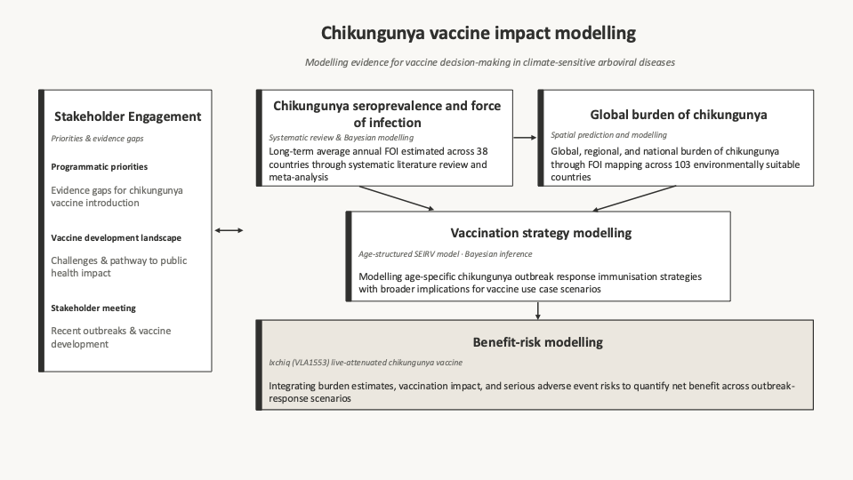
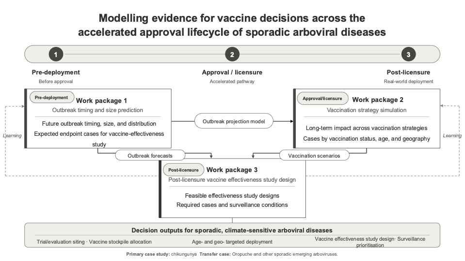

## Research Themes

### Chikungunya

My research on chikungunya spans the full pipeline from burden estimation to vaccine impact modelling — including force of infection estimation, global burden quantification, spatial risk mapping, and age-specific vaccination strategy evaluation — with a focus on generating policy-relevant evidence through stakeholder engagement.

The aim is to generate useful evidence to inform chikungunya vaccination strategies through analysis of stakeholders' perceptions, estimation of chikungunya seroprevalence and burden, and modelling the health impact of vaccination. Key objectives include:

(1) Developing a mathematical model fitted to age-stratified chikungunya seroprevalence data

(2) Estimating the disease burden for chikungunya at the global, regional, and national levels through a systematic review and statistical modelling

(3) Conducting a qualitative assessment of stakeholders' perceptions of the risk of chikungunya outbreaks and feasibility of chikungunya vaccination

(4) Modelling impact of age-stratified outbreak response immunisation strategies

(5) Benefit-risk modelling of the live-attenuataed chikungunya vaccine for travel vaccination and outbreak response immunisation

### Climate-Sensitive Arboviral Diseases

I study how climate change affects the transmission dynamics and geographic distribution of arboviral diseases, with a focus on identifying populations at risk and informing vaccine introduction decisions.

### Leshimaniasis

Out team works on health impact and cost-effectiveness of leishmania vaccination in the target countries: mathematical modelling and early-stage economic evaluation.

### Epidemic preparedness through vaccine impact modelling

Our team will develop a modelling framework to generate evidence for vaccine decision-making across the accelerated approval lifecycle of sporadic arboviral diseases, using chikungunya as the primary case study and Oropouche as a transferable secondary application.

We aim to address key evidence gaps that arise when vaccines receive accelerated approval for diseases with explosive but irregular outbreak patterns. Our work will focus on three core objectives:

(1) Reconstructing age-structured transmission and susceptibility dynamics to predict outbreak timing, size, and geography using a Bayesian age-structured state space SEIR model fitted to multi-year surveillance data

(2) Comparing long-term vaccination strategies under uncertainty in vaccine protection, waning immunity, boosting, and age- and geography-specific risk

(3) Designing post-licensure evidence systems by simulating surveillance and vaccine effectiveness study designs tailored to sporadic outbreak settings
